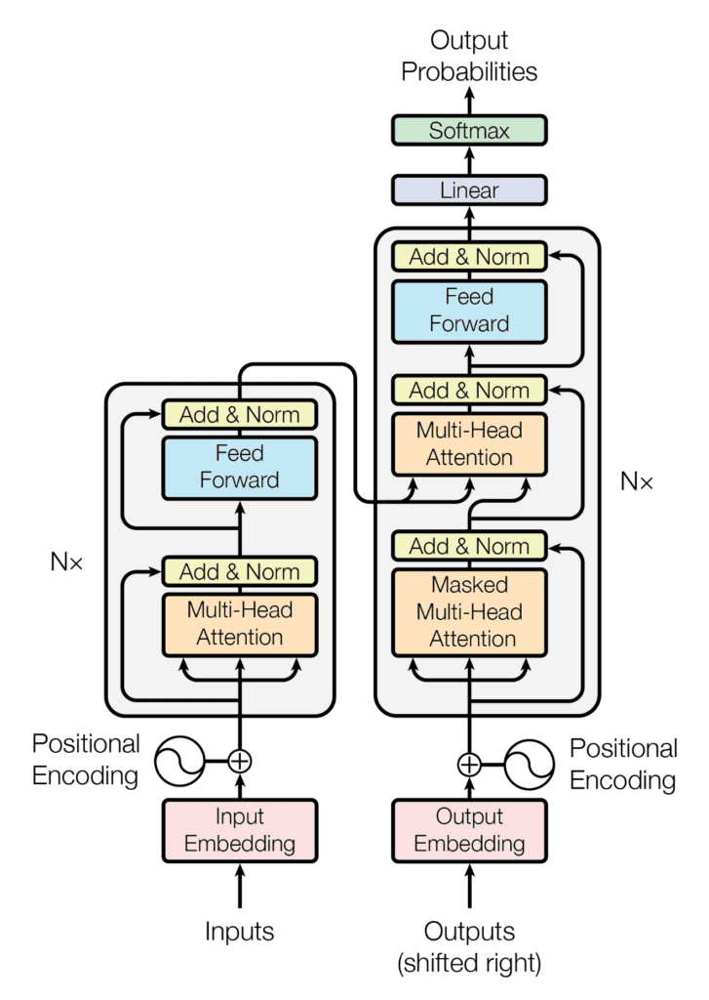
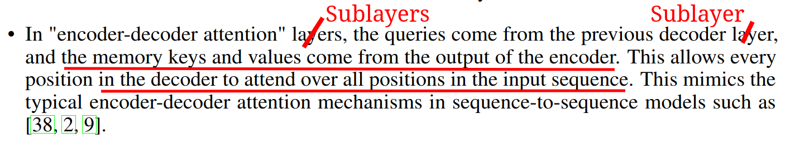
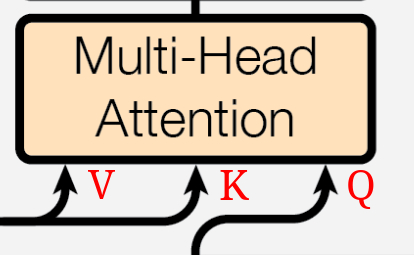
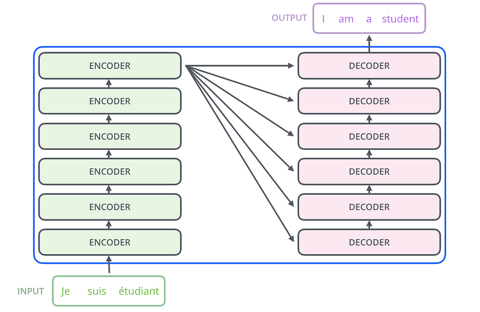
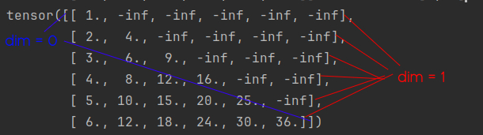
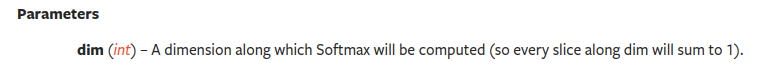

# TransformerForDummies

I found that some important details of the Transformer implementation were are not totally clear 
and I needed to search for other implementation or to explanation of these details. For this reason, 
I decided to report here the most important doubts that I had hoping that could some new people entering in this field!

The explainations assume a basic knowledge of the transformer models (e.g. Encoder-Decoder architecture, Multi-Head Attention Mechanism, ...),
avoiding to create a redundant repository over millions already present on the web, and focusing mainly on the ambiguities.

## The Architecture: Questions
The very well known image that depict the transformer architecture hides a lot of important information that are useful for the correct implementation.
<p align="center">

</p>

Some of the first questions that came up in my mind when I had a look to this picture were:
### 1) **How the Encoder and Decoder are connected??**

The encoder and the decoder can have multiple layers (N as reported). The encoder and the decoder are connected. The output of the encoder seems to be connected to the decoder. 
But! Which layer?? The last one, the first one?? All of them??

### 2) **How the Encoder output is connected to the 'Multi-Head Attention of the Decoder'?**

Every attention block has three inputs that should be the Query, Key and Value. Which one is what??

### 3) **Why only the first attention block of the decoder is depicted as 'Masked' and not the Self-Attention of the encoder and the 'Cross-Attention block'?**

Later in this markdown more on masks.

## The architecture: Answers

**The answer to these questions resides in a couple of sentence in the paper**:

<p align="center">

</p>

### 2) **The Keys and the Values come from the Encoder, the Queries come from the last sublayer of the decoder.**

<p align="center">

</p>

### 1) **The Encoder Output is reported to ALL the Decoder Layers**

This could be extracted from the phrase: **_This allows every position in the decoder to attend over all the positions in the input sequence_**, as also reported in the image:


<p align="center">

</p>
Picture taken by [](https://www.truefoundry.com/blog/transformer-architecture)

3) **Only the first attention block of the decoder has a mask**

This is only partially true, because here we are talking about only the Look-Ahead Mask.

## The Masks: Questions

I admit that I struggled a bit to understand well how the masking is used in this model, mainly because a looot of things are given for granted,
and appear clear and obvious only when you start to implement things and problems come up.

### 1) **How the masks are included in the attention computation?**

### 2) **Do other masks exist?? Why?? and how to include them as well??**

## The Masks: Answers


### 1) **Here we show how to include the Look-Ahead/Causal Mask and what are the implications**


### The Look-Ahead/Causal Mask

First of all, I would have named the "Look Ahead Mask" as "DON'T Look Ahead Mask".
This mask is used for the decoder to allow the computation of the attention only backward in the sentence. 

Yes, it has sense, but why?? Well, because at the inference time, the decoder will act in auto-regressive manner, 
that means that it only has the encoder input as complete sentence, and the decoder should generate word by word during translation, 
hence only using the already generated words. For this reason, we need to force at the training time to learn to predict the ground-truth output sentence without looking at the next words, otherwise that's cheating!

Here we report the shape of the "Don't look ahead mask" also called "Causal Mask":
$M \in \mathbb{R}^{L x L}$

$$M = \begin{bmatrix} 
0 & -inf & -inf &  -inf & -inf &  -inf  \\\
0 & 0 & -inf & -inf & -inf & -inf \\\
0 & 0 & 0 & -inf & -inf & -inf \\\
0 & 0 & 0 & 0 & -inf & -inf \\\
0 & 0 & 0 & 0 & 0 & -inf \\\
0 & 0 & 0 & 0 & 0 & 0 
\end{bmatrix}
$$

Notice that size of the mask is $L x L$ that is the lenght of the sentence. 

The matrix is composed by zeros and -inf, we'll see in a moment why:

### **The computation of the masked attention is then**:


$$
    Attention(Q, K, V) = softmax(\frac{QK^{T}}{\sqrt{d_k}} + M)V
$$

Notice the mask is inside the softmax function.

This is done because if we consider $Q \in \mathbb{R}^{L \times 1}, K \in \mathbb{R}^{L \times 1}, V \in \mathbb{R}^{L \times 1}$,
We would have $QK^{T} \in \mathbb{R}^{L \times L}$

Now, **the softmax function is applied column wise**, this is just because the later multiplication with $V$ is on the right-hand side.

Remind that:
$Softmax(x_i) = \frac{e^{x_i}}{\sum_i e^{x_i}}$
Where the $x_i$ is in a set $X = \{x_1, x_2, ..., x_n\}$, this function just reweights the value to be summed to 1.

Hence, when the value is $-inf$ the softmax gives a weight of $0$ that means "don't consider this value".

As an example:

$$Q = K = V = \begin{bmatrix}1 \\\
2 \\\
3 \\\
4 \\\
5 \\\
6 \end{bmatrix}
$$

$$QK^{T} = \begin{bmatrix} 1 \\\
2 \\\
3 \\\
4 \\\
5 \\\
6 \end{bmatrix} * \begin{bmatrix} 1 & 2 & 3 & 4 & 5 & 6 \end{bmatrix} \\
= \begin{bmatrix} 1 & 2 & 3 & 4 & 5 & 6 \\\ 
2 & 4 & 6 & 8 & 10 & 12 \\\
3 & 6 & 9 & 12 & 15 & 18 \\\
4 & 8 & 12 & 16 & 20 & 24  \\\ 
5 & 10 & 15 & 20 & 25 & 30\\\
6 & 12 & 18 & 24 & 30 & 36 
\end{bmatrix}$$

That of course is simmetric. Moreover, we have that $QK^{T} = \frac{QK^{T}}{\sqrt{d_k}}$ where $d_k$ is just the dimension of the single vector that in our example is just 1.

$$\frac{QK^{T}}{\sqrt{d_k}} = \begin{bmatrix} 1 & 2 & 3 & 4 & 5 & 6 \\\ 
2 & 4 & 6 & 8 & 10 & 12 \\\
3 & 6 & 9 & 12 & 15 & 18 \\\
4 & 8 & 12 & 16 & 20 & 24  \\\ 
5 & 10 & 15 & 20 & 25 & 30\\\
6 & 12 & 18 & 24 & 30 & 36 
\end{bmatrix}$$

$$\frac{QK^{T}}{\sqrt{d_k}} + M = \begin{bmatrix} 
1 & -inf & -inf & -inf & -inf &  -inf  \\\
2 & 4 & -inf & -inf & -inf & -inf \\\
3 & 6 & 9 & -inf & -inf & -inf \\\
4 & 8 & 12 & 16 & -inf &  -inf\\\
5 & 10 & 15 & 20 & 25 & -inf  \\\
6 & 12 & 18 & 24 & 30 & 36 
\end{bmatrix}$$

Now we need to apply the **softmax function ROW-WISE**. Why column-wise? because remember that we are using column vectors:
$Q = K = V \in \mathbb{R}^{L \times 1}$ for this reason after the softmax we have $softmax(\frac{QK^T}{\sqrt{d_k}}) \in \mathbb{R}^{L \times L}$ that multiplied by $V \in \mathbb{R}^{L \times 1}$ we have a new column vector $A \in \mathbb{R}^{L \times 1}$ ( $(L \times L)\ times (L \times 1) = L \times (L \times L) \times 1 = L \times 1$ )


### ACHTUNG

#### 1. The softmax function is numerical unstable for -inf -> modify -inf values in a VERY HIGH NEGATIVE VALUE -1E15 for example
#### 2. The softmax function is actually applied "for each rows"! Remember how pytorch handles the dimensions!

This could be trivial for the practitioners but it's important to explicate everything (the repo it's called **_TransformerForDummies_** after all :D)

First of all, remember what the "dimensions" mean in the pytorch: dim = 0, means that you are indexing through the rows! dim = 1 means that you are indexing through the columns. 

<p align="center">

</p>
Moreover, the Pytorch documentation of the softmax function reports:
<p align="center">

</p>
That in this case means that every rows will be "collapsed" independently to compute the softmax.
Hence, after the:

```python
values = torch.softmax(values, dim=-1)
```
We'll have:

$$
    Softmax(\frac{QK^{T}}{\sqrt{d_k}} + M) = \begin{bmatrix} 
1.0000e+00 & 0 & 0 & 0 & 0 &  0  \\\
1.1920e-01 & 8.8080e-01 & 0 & 0 & 0 & 0\\\
2.3556e-03 & 4.7314e-02 & 9.5033e-01 & 0 & 0 & 0\\\
6.0317e-06 & 3.2932e-04 & 1.7980e-02 & 9.8168e-01 & 0 &  0 \\\
2.0473e-09 & 3.0384e-07 & 4.5094e-05 & 6.6925e-03 & 9.9326e-01 & 0  \\\
9.3344e-14 & 3.7658e-11 & 1.5192e-08 & 6.1290e-06 &  2.4726e-03 & 9.9752e-01
\end{bmatrix}
$$

The sum "for each row" is always 1.0, try to believe!

Finally, we can compute the output values of the attention mechanism:

$$Softmax(\frac{QK^{T}}{\sqrt{d_k}} + M)V = \begin{bmatrix} 
1.0000e+00 & 0 & 0 & 0 & 0 &  0  \\\
1.1920e-01 & 8.8080e-01 & 0 & 0 & 0 & 0\\\
2.3556e-03 & 4.7314e-02 & 9.5033e-01 & 0 & 0 & 0\\\
6.0317e-06 & 3.2932e-04 & 1.7980e-02 & 9.8168e-01 & 0 &  0 \\\
2.0473e-09 & 3.0384e-07 & 4.5094e-05 & 6.6925e-03 & 9.9326e-01 & 0  \\\
9.3344e-14 & 3.7658e-11 & 1.5192e-08 & 6.1290e-06 &  2.4726e-03 & 9.9752e-01
\end{bmatrix} * \begin{bmatrix} 1 \\\ 2 \\\ 3 \\\ 4 \\\ 5 \\\ 6\end{bmatrix}$$

The results is:

$$Attention(Q, V, K) = \begin{bmatrix}
    1.0\\\
    1.8808 \\\
    2.9480 \\\
    3.9813 \\\
    4.9932 \\\
    5.9975
    \end{bmatrix}$$

This new vector represents a weighted combination of the values of $V$, in fact the first component consider only the first value, the second component is the weighted sum of the first two component, and so on...


### 2) **The Padding Mask exists!!**

The padding mask has a trivial reason on why it exists: **not all the sentences have the same lenght!**. **BUT WAIT!**

For this reason, we:
- Add padding tokens to bring all the sentences to have the same lenght;
- create a mask that "block" the softmax function to consider this token that are uninformative.

## The Padding Mask: requires a paragraph for itself...
### 1) What if I do not want to use multiple sentences?? That means BATCH SIZE = 1?

#### ***<p style="text-align:center;">In this case we don't need a padding mask</p>***

### 2) Wait? But the input encoder sentence and the input decoder sentence can have different lenghts? What about the padding then?

At least in theory the two inputs can have a different lenghts. 

Let's assume that we have the batch size equals to 1, the encoder output is $X \in \mathbb{R}^{L_1 \times E}$ and the input of the decoder is $ Y \in \mathbb{R}^{L_2 \times E}$ (the same dimensionality of the input of the decoder is reported till the point of the conjuction of the two, that is the "Cross-Attention"), where $L_1$ is the lenght of the sentence in the encoder, $L_2$ is the lenght of the sentence in the decoder, $E$ is the embedding size.

First of all, the $E$ should be the same for the encoder and the decoder, if it is not obvious now, it will be in a second.

About the two sequence lenght instead, we remind from the answer 2, that the decoder offers the query to the attention, the encoder the keys and the values instead. Hence, $ Q \in \mathbb{R}^{L_2 \times E}, K \in \mathbb{R}^{L_1 \times E}, V \in \mathbb{R}^{L_1 \times E}$

$$\frac{QK^{T}}{\sqrt{|E|}} = \mathbb{R}^{(L_2 \times E) \times (E \times L_1)} = \mathbb{R}^{L_2 \times L_1}$$

This first explains why the embedding size should be equal for the both encoder and the decoder. 

Then, after the attention computation:

$$softmax(\frac{QK^{T}}{\sqrt{|E|}})V = \mathbb{R}^{(L_2 \times L_1) \times (L_1 \times E)} = \mathbb{R}^{L_2 \times E}$$

So,
#### ***<p style="text-align:center;">Yes, the encoder and decoder sequences can have different lenght, in this case the output of the decoder will have the same decoder lenght. </p>***

From a practical point of view, I've never seen an implementation with different lenghts, because it's easier to implement and because it mostly has no sense to do it otherwise.
The only reason in which I could implement different lenghts encoder-decoder is when the lenghts of the sentences in the dataset are strongly different in the distribution between the source and target languages (assuming a translation task), in this case maybe I could have a speed up in the computation.

### 3) Ok, but the Transformer has 3 attention blocks in which one I should insert the padding mask?

Reporting the same paragraph above:

<p align="center">

</p>

The sentence "*This allows every
position in the decoder to attend over all positions in the input sequence*" can be interpreted that since the encoder sequence is already went through a processing,
it is possible to use all the embeddings vectors, so not padding mask in the cross attention. Furthermore, in the Self-Attention blocks for both Encoder and Decoder,
seems natural the usage.

Hence:
- **Encoder Self-Attention block: PADDING MASK**
- **Decoder MASKED Self-Attention block: PADDING MASK + CAUSAL MASK**
- **Encoder-Decoder Cross-Attention block: NO PADDING**


### 4) How is done the Padding Mask? and how is employed?