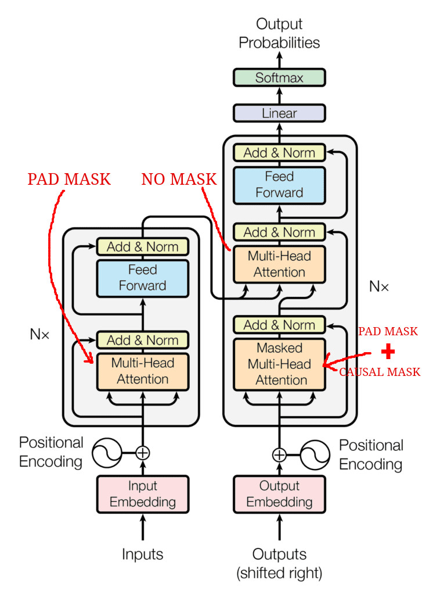
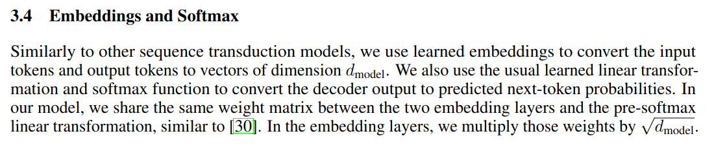

# TransformerForDummies

I found that some important details of the Transformer implementation were are not totally clear 
and I needed to search for other implementation or explanations of these details. 

For this reason, I decided to report clarifications for the most important doubts that I had, hoping that this could help some new people entering in this field!

The explainations assume a basic knowledge of the transformer models (e.g. Encoder-Decoder architecture, Multi-Head Attention Mechanism, tokenization, etc.),
avoiding to create a redundant repository over millions already present on the web, and focusing mainly on the ambiguities.

This Repo offers:

#### 1. A Readme with all the revealed ambiguities that I found
#### 2. A complete, clear and commented implementation of the Transformer model in Pytorch and Pytorch Lightning

## The Architecture 
The very well known image that depict the transformer architecture hides a lot of important information that are useful for the correct implementation.
<p align="center">

</p>

Some of the first questions that came up in my mind when I had a look to this picture were:
### 1) **How the Encoder and Decoder are connected?**

The encoder and the decoder can have multiple layers (N as reported). The encoder and the decoder are connected. The output of the encoder seems to be connected to the decoder. 
But! Which layer?? The last one, the first one?? All of them??

### <center>**The Encoder Output is reported to ALL the Decoder Layers**</center>
as reported in:

<p align="center">

</p>

Picture taken by (https://www.truefoundry.com/blog/transformer-architecture)

### 2) **How the Encoder's output is connected to the 'Multi-Head Attention of the Decoder'?**
Every attention block has three inputs that should be the Query, Key and Value. Which one is what??

###  <center>**The Keys and the Values come from the Encoder, the Queries come from the last sublayer of the decoder.**</center>

<p align="center">

</p>

Both the above answers could be extracted with a bit of interpretation from:
<p align="center">

</p>
Notice the phrase: 

*This allows every position in the decoder to attend over all the positions in the input sequence*


### 3) **What's the difference among the three different attention blocks?**

In the rest of the README we'll call 
- Self-Attention block of the encoder: the attention block of the encoder (of course :) )
- Masked-Self-Attention of block of the decoder: you got it!
- Cross-Attention block: the block where encoder is connected to the decoder.

Later a more detailed answer!

## The Masks

I admit that I struggled a bit to understand well how the masking is used in this model, mainly because a looot of things are given for granted,
and appear clear and obvious only when you start to implement things and problems come up.

### 1) **How the mask is included in the Self-Attention block of the decoder?**

### The Look-Ahead/Causal Mask

First of all, I would have named the "Look Ahead Mask" as "DON'T Look Ahead Mask".
This mask is used for the decoder to allow the computation of the attention only backward in the sentence. 

Yes, it has sense, but why?? Well, because at the inference time, the decoder will act in auto-regressive manner, 
that means that it only has the encoder input as complete sentence, and the decoder should generate word by word during translation, 
hence only using the already generated words. For this reason, we need to force at the training time to learn to predict the ground-truth output sentence without looking at the next words, otherwise that's cheating!

Here we report the shape of the "Don't look ahead mask" also called "Causal Mask":
$M^C \in \mathbb{R}^{L x L}$

$$M^C = \begin{bmatrix} 
0 & -inf & -inf &  -inf & -inf &  -inf  \\\
0 & 0 & -inf & -inf & -inf & -inf \\\
0 & 0 & 0 & -inf & -inf & -inf \\\
0 & 0 & 0 & 0 & -inf & -inf \\\
0 & 0 & 0 & 0 & 0 & -inf \\\
0 & 0 & 0 & 0 & 0 & 0 
\end{bmatrix}
$$

Notice that size of the mask is $L \times L$ that is the lenght of the sentence. 

The matrix is composed by zeros and $-inf$, we'll see in a moment why:

### **The computation of the masked attention is then**:


$$
    Attention(Q, K, V) = softmax\bigg(\frac{QK^{T}}{\sqrt{d_k}} + M\bigg)V
$$

Notice the mask is inside the softmax function.

This is done because if we consider $Q \in \mathbb{R}^{L \times 1}, K \in \mathbb{R}^{L \times 1}, V \in \mathbb{R}^{L \times 1}$,
We would have $QK^{T} \in \mathbb{R}^{L \times L}$

Now, **the softmax function is applied row-wise**, this is just because the later multiplication with $V$ is on the right-hand side.

Remind that:
$softmax(x_i) = \frac{e^{x_i}}{\sum_i e^{x_i}}$
Where the $x_i$ is in a set $X = \{x_1, x_2, ..., x_n\}$, this function just reweights the value to be summed to 1.

Hence, when the value is $-inf$ the softmax gives a weight of $0$ that means "don't consider this value".

With an example everything is always clearer!

$$Q = K = V = \begin{bmatrix}1 \\\
2 \\\
3 \\\
4 \\\
5 \\\
6 \end{bmatrix} \in \mathbb{R}^{L \times 1}, L = 6
$$

$$QK^{T} = \begin{bmatrix} 1 \\\
2 \\\
3 \\\
4 \\\
5 \\\
6 \end{bmatrix} * \begin{bmatrix} 1 & 2 & 3 & 4 & 5 & 6 \end{bmatrix} \\
= \begin{bmatrix} 1 & 2 & 3 & 4 & 5 & 6 \\\ 
2 & 4 & 6 & 8 & 10 & 12 \\\
3 & 6 & 9 & 12 & 15 & 18 \\\
4 & 8 & 12 & 16 & 20 & 24  \\\ 
5 & 10 & 15 & 20 & 25 & 30\\\
6 & 12 & 18 & 24 & 30 & 36 
\end{bmatrix}$$

That of course is simmetric. Moreover, we have that $QK^{T} = \frac{QK^{T}}{\sqrt{d_k}}$ where $d_k$ is just the dimension of the single vector that in our example is just 1.

$$\frac{QK^{T}}{\sqrt{d_k}} = \begin{bmatrix} 1 & 2 & 3 & 4 & 5 & 6 \\\ 
2 & 4 & 6 & 8 & 10 & 12 \\\
3 & 6 & 9 & 12 & 15 & 18 \\\
4 & 8 & 12 & 16 & 20 & 24  \\\ 
5 & 10 & 15 & 20 & 25 & 30\\\
6 & 12 & 18 & 24 & 30 & 36 
\end{bmatrix}$$

$$\frac{QK^{T}}{\sqrt{d_k}} + M^C = \begin{bmatrix} 
1 & -inf & -inf & -inf & -inf &  -inf  \\\
2 & 4 & -inf & -inf & -inf & -inf \\\
3 & 6 & 9 & -inf & -inf & -inf \\\
4 & 8 & 12 & 16 & -inf &  -inf\\\
5 & 10 & 15 & 20 & 25 & -inf  \\\
6 & 12 & 18 & 24 & 30 & 36 
\end{bmatrix}$$

Now we need to apply the **softmax function ROW-WISE**. Why row-wise? because remember that we are using column vectors:
$Q = K = V \in \mathbb{R}^{L \times 1}$ for this reason after the softmax we have $softmax(\frac{QK^T}{\sqrt{d_k}}) \in \mathbb{R}^{L \times L}$ that multiplied by $V \in \mathbb{R}^{L \times 1}$ we have a new column vector $A \in \mathbb{R}^{L \times 1}$ ( $(L \times L)\ times (L \times 1) = L \times (L \times L) \times 1 = L \times 1$ )


### ACHTUNG

#### 1. The softmax function is numerical unstable for $-inf$. For this reason, we need to modify $-inf$ values in a VERY HIGH NEGATIVE VALUE like -1E15;
#### 2. The softmax function is applied "for each rows"! But remember how Pytorch handles the dimensions!

This could be trivial for the practitioners but it's important to explicate everything (the repo it's called **_TransformerForDummies_** after all :D)

First of all, remember what the "dimensions" mean in the pytorch: dim = 0, means that you are indexing through the rows! dim = 1 means that you are indexing through the columns. 

<p align="center">

</p>

However, the Pytorch documentation of the softmax function reports:
<p align="center">

</p>

That in this case means that every rows will be "collapsed" independently to compute the softmax.
Hence, after the:

```python
values = torch.softmax(values, dim=-1)
```
Using the last dimension! That in our case will be all the single rows!

We'll have:

$$
    Softmax\bigg(\frac{QK^{T}}{\sqrt{d_k}} + M^C\bigg) = \begin{bmatrix} 
1.0000e+00 & 0 & 0 & 0 & 0 &  0  \\\
1.1920e-01 & 8.8080e-01 & 0 & 0 & 0 & 0\\\
2.3556e-03 & 4.7314e-02 & 9.5033e-01 & 0 & 0 & 0\\\
6.0317e-06 & 3.2932e-04 & 1.7980e-02 & 9.8168e-01 & 0 &  0 \\\
2.0473e-09 & 3.0384e-07 & 4.5094e-05 & 6.6925e-03 & 9.9326e-01 & 0  \\\
9.3344e-14 & 3.7658e-11 & 1.5192e-08 & 6.1290e-06 &  2.4726e-03 & 9.9752e-01
\end{bmatrix}
$$

The sum "for each row" is always 1.0, try to believe!

Finally, we can compute the output values of the attention mechanism:

$$Softmax\bigg(\frac{QK^{T}}{\sqrt{d_k}} + M^C\bigg)V = \begin{bmatrix} 
1.0000e+00 & 0 & 0 & 0 & 0 &  0  \\\
1.1920e-01 & 8.8080e-01 & 0 & 0 & 0 & 0\\\
2.3556e-03 & 4.7314e-02 & 9.5033e-01 & 0 & 0 & 0\\\
6.0317e-06 & 3.2932e-04 & 1.7980e-02 & 9.8168e-01 & 0 &  0 \\\
2.0473e-09 & 3.0384e-07 & 4.5094e-05 & 6.6925e-03 & 9.9326e-01 & 0  \\\
9.3344e-14 & 3.7658e-11 & 1.5192e-08 & 6.1290e-06 &  2.4726e-03 & 9.9752e-01
\end{bmatrix} * \begin{bmatrix} 1 \\\ 2 \\\ 3 \\\ 4 \\\ 5 \\\ 6\end{bmatrix}$$

The results is:

$$Attention(Q, V, K) = \begin{bmatrix}
    1.0\\\
    1.8808 \\\
    2.9480 \\\
    3.9813 \\\
    4.9932 \\\
    5.9975
    \end{bmatrix}$$

This new vector represents a weighted combination of the values of $V$, in fact the first component consider only the first value, the second component is the weighted sum of the first two components, and so on...


### The Padding Mask

The padding mask has a trivial reason on why it exists: **not all the sentences have the same lenght!** **BUT WAIT!**

For this reason, we:
- **Add padding tokens to bring all the sentences to have the same lenght;**
- **Create a mask that "block" the softmax function to consider this token that are uninformative.**

## The Padding Mask: requires a paragraph for itself... Q&A
### 1) What if I do not want to use multiple sentences?? That means BATCH SIZE = 1?

### ***<center>In this case we don't need a padding mask</center>***

### 2) Wait? But the input encoder sentence and the input decoder sentence can have different lenghts? What about the padding then?

At least in theory the two inputs can have a different lenghts. 

Let's assume that we have the batch size equals to 1, the encoder output is $X \in \mathbb{R}^{L_1 \times E}$ and the input of the decoder is $Y \in \mathbb{R}^{L_2 \times E}$ (the same dimensionality of the input of the decoder is reported till the point of the conjuction of the two, that is the "Cross-Attention"), where $L_1$ is the lenght of the sentence in the encoder, $L_2$ is the lenght of the sentence in the decoder, $E$ is the embedding size.

First of all, the $E$ should be the same for the encoder and the decoder, if it is not obvious now, it will be in a second.

About the two sequence lenght instead, we remind from the answer 2, that the decoder offers the query to the attention, the encoder the keys and the values instead. Hence, $Q \in \mathbb{R}^{L_2 \times E}, K \in \mathbb{R}^{L_1 \times E}, V \in \mathbb{R}^{L_1 \times E}$

$$\frac{QK^{T}}{\sqrt{|E|}} \in \mathbb{R}^{(L_2 \times E) \times (E \times L_1)} = \mathbb{R}^{L_2 \times L_1}$$

This first explains why the embedding size should be equal for the both encoder and the decoder. 

Then, after the attention computation:

$$softmax(\frac{Q_{d}K_{e}^{T}}{\sqrt{|E|}})V_{e} \in \mathbb{R}^{(L_2 \times L_1) \times (L_1 \times E)} = \mathbb{R}^{L_2 \times E}$$

where the pedices $e$ and $d$ denote the encoder and the decoder respectively, since we're talking about the Cross-Attention block.
So,
### ***<center>Yes, the encoder and decoder sequences can have different lenghts, in this case the output of the decoder will have the same decoder's sequence lenght. </center>***

From a practical point of view, I've never seen an implementation with different lenghts, because it's more annoying to implement and because it mostly has no sense to do it.
The only reason in which I could implement different lenghts encoder-decoder is when the lenghts of the sentences in the dataset are strongly different in the distribution between the source and target languages (assuming a translation task), in this case maybe I could have a speed up in the computation.

### ***<center>In the case we want to the use (as often done) the same sequence lenght for both encoder and decoder, you probably will need a padding mask anyway, also in the case of batch size = 1.</center>***


### 3) Ok, but the Transformer has 3 attention blocks in which one I should insert the padding mask?

Reporting the same paragraph above:

<p align="center">

</p>

The sentence "*This allows every
position in the decoder to attend over all positions in the input sequence*" can be interpreted that since the encoder sequence has already gone through a processing,
it is possible to use all the embeddings vectors in the case of the Cross-Attention, so no padding mask in this case. Furthermore, in the Self-Attention blocks for both Encoder and Decoder,
seems natural the usage instead.

Finally a small recap:

#### - **Encoder Self-Attention block wants: PADDING MASK**
#### - **Decoder MASKED Self-Attention block wants: PADDING MASK + CAUSAL MASK**
#### - **Encoder-Decoder Cross-Attention block wants: NO PADDING**

<p align="center">

</p>

### 4) How is done the Padding Mask? and how is employed?

First, if we want to talk about Padding mask we need to consider the Batch size > 1 that we'll name $B$. Hence, $Q \in \mathbb{R}^{B \times L \times E}, K \in \mathbb{R}^{B \times L \times E}, V \in \mathbb{R}^{B \times L \times E}$, $L$ is the sequence lenght and $E$ is the embedding size.

Now, we'll use an arbitrary value for the padding token $[PAD]$, to align all the $|B|$ sequences to the same lenght $L$. 

As an example, the "proto-padding-mask" where $|B| = 4$ and $|L| = 6$, will be:

$$|B| \underbrace{\begin{bmatrix} x_1 & x_2 & [PAD] & [PAD] & [PAD] & [PAD] \\\
    x_3 & x_4 & x_5 & x_6 & [PAD] & [PAD] \\\
x_7 & x_8 & x_9 & [PAD] & [PAD] & [PAD] \\\
x_{10} & x_{11} & x_{12} & x_{13}] & x_{14} & [PAD] 
\end{bmatrix}}_{|L|}$$

Remember that the scaled-dot-product attention function with a generic mask is:

$$
    Attention(Q, K, V) = softmax(\frac{QK^{T}}{\sqrt{d_k}} + M)V
$$

for the operation $QK^{T}$ the transposition for the tensor $K$ is done only on the last two dimensions (the batch dim is not considered), so 

$$QK^{T} \in \mathbb{R}^{(B \times L \times E) \times (B \times E \times L) } = \mathbb{R}^{B \times L \times L}
$$

Now, for each sentence in the set of size $|B|$ we have a $L \times L$ matrix that should be masked. 
To better understand how to construct our padding mask we can make and example with a single sentence, let's say the third row!

$$Q = K = \begin{bmatrix}x_7 \\\
x_8 \\\
x_9 \\\
[PAD] \\\
[PAD] \\\ 
[PAD] \end{bmatrix}\in \mathbb{R}^{1xLxE}$$

Considering every element like $x_7 \in \mathbb{R}^{E}$. So,

$$QK^{T} = \begin{bmatrix}x_7 \\\
x_8 \\\
x_9 \\\
[PAD] \\\
[PAD] \\\ 
[PAD] \end{bmatrix} * \begin{bmatrix}x_7 & x_8 & x_9 & [PAD] & [PAD] & [PAD] \end{bmatrix} = \begin{bmatrix} x_7x_7 & x_7x_8 & x_7x_9 & x_7[PAD] & x_7[PAD] & x_7[PAD] \\\
x_8x_7 & x_8x_8 & x_8x_9 & x_8[PAD] & x_8[PAD] & x_8[PAD] \\\
x_9x_7 & x_9x_8 & x_9x_9 & x_9[PAD] & x_9[PAD] & x_9[PAD] \\\
[PAD]x_7 & [PAD]x_8 & [PAD]x_9 & [PAD][PAD] & [PAD][PAD] & [PAD][PAD] \\\
[PAD]x_7 & [PAD]x_8 & [PAD]x_9 & [PAD][PAD] & [PAD][PAD] & [PAD][PAD] \\\
[PAD]x_7 & [PAD]x_8 & [PAD]x_9 & [PAD][PAD] & [PAD][PAD] & [PAD][PAD] 
\end{bmatrix}
$$

It's easy to see that every position in which we have a multiplication by the padding token (actually a dot product because every entry is $\in \mathbb{R}^{E}$) should be masked.

Hence, our padding mask for the third sentence will be:

$$
    M^{P}_3 = \begin{bmatrix} 0 & 0 & 0 & -inf & -inf & -inf \\\
0 & 0 & 0 & -inf & -inf & -inf \\\
0 & 0 & 0 & -inf & -inf & -inf \\\
-inf & -inf & -inf & -inf & -inf & -inf \\\
-inf & -inf & -inf & -inf & -inf & -inf  \\\
-inf & -inf & -inf & -inf & -inf & -inf  
\end{bmatrix}
$$

It's easy to derive this mask with these operations:

```python
B = 1
L = 6
padding_mask = torch.FloatTensor([0, 0, 0, 0, -torch.inf, -torch.inf]).unsqueeze(0).unsqueeze(0)
padding_mask = padding_mask.repeat(1, L, 1)
i, j = torch.triu_indices(L, L)
vals = padding_mask[:, i, j]
padding_mask = padding_mask.transpose(-2, -1)
padding_mask[:, i, j] = vals
```
but I'm pretty sure more efficient ways exists.

Hence, we'll have a different padding mask for each sentence. 

$$M^{P} = \[ M^{P}_1, ..., M^{P}_B \]$$

### Recap for the Masking

#### - Self-Attention Encoder block: 

$$SelfAttention(Q_{e}, K_{e}, V_{e}) = softmax(\frac{Q_{e}K_{e}^{T}}{\sqrt{d_k}} + M_e^{P})V_{e}$$

#### - Decoder MASKED Self-Attention block: : 

$$MaskedSelfAttention(Q_{d}, K_{d}, V_{d}) = softmax(\frac{Q_{d}K_{d}^{T}}{\sqrt{d_k}} + M_d^{P} + M^{C})V_{d}$$

#### - Encoder-Decoder Cross-Attention block: 

$$CrossAttention(Q_{d}, K_{e}, V_{e}) = softmax(\frac{Q_{d}K_{e}^{T}}{\sqrt{d_k}})V_{e}$$

Where the pedices $e$ or $d$ in this case stand for Encoder and Decoder. $M^P$ is the Padding Mask, $M^C$ is the Causal Mask, $d_k$ is the embedding dimension that in our case is $E$, (in whole in example we didn't mention the different heads).

## The Embeddings

### 1) How the embeddings layers are implemented?

The embeddings layer are used to map each token into a vector. 

To allow this it's easy to just use the *torch.nn.Embedding(num_embeddings, embedding_dim, ...)* class. Internally the class is just a linear layer that maps an integer into a vector. Still more under the hood, each integer is considered in one-hot-encoding.

Hence, the parameters will be:
- num_embeddings = VOCABULARY SIZE
- embedding_dim = EMBEDDING SIZE

Unfortunately for this reason, the embedding layer is one of the storage heavy part of the model. Let's make an example:
VOCABULARY SIZE = 50k and EMBEDDING SIZE = 512, we'll have a linear layer of $512 \times 50'000 = 25,6*10^6$ parameters, that are more than 25,6 millions of parameters. 

Moreover, considering that we have two different embeddings layers ( one for the encoder and one for the decoder), we have more than 50 millions parameters just for the first step of the processing.
Remind that this layer is trainable.
## The last layer of the Decoder

Even if this part is almost straightforward, in the paper is the most ambiguous one. 

It's intuitive that we just need a linear layer and a softmax to have a "vocabulary-sized" vector of probabilities to sample the most probable next word.
However, let's read:

<p align="center">

</p>

First of all,
- *We also use the usual learned linear transformation and softmax function to convert the decoder output to predicted next-token probabilities. In
our model, we share the same weight matrix between the two embedding layers and the pre-softmax
linear transformation, similar to [ 30 ].*

So here is written that the output linear layer before the softmax is just the inverted weight matrix of the embedding layer of the decoder and the encoder as well!!

 :confounded: Why the embeddings that map the German language should share the same weights that map Italian??

Moreover!! This means that the Vocabulary size of the SINGLE SHARED embedding layer should be: VOCAB_SIZE = German_VOCAB_SIZE + Italian_VOCAB_SIZE :angry: (I'm using as an example German as source language and Italian as target language in a translation task) 

And yet!! The output of the decoder should map the next word into a German_VOCAB_SIZE + Italian_VOCAB_SIZE one-hot vector even though the only language possible is Italian, because is the target language!!! :angry: :angry:

Still more non-sense!!

I searched a lot and I found one only sensed answer, thanks to 'noe' on Datascience.Stackexchange:

- *The source and target embeddings can be shared or not. This is a design decision. They are normally shared if the token vocabulary is shared, and this normally happens when you have languages with the same script (i.e. the Latin alphabet). If your source and target languages are e.g. English and Chinese, which have different writing systems, your token vocabularies would probably not be shared, and then the embeddings wouldn't be shared either. NOE*

- *Then, the linear projection before the softmax can be shared with the target embedding matrix. This is also a design decision. It is frequent to share them. NOE*

For the all answer refer [HERE](https://datascience.stackexchange.com/questions/84930/weights-shared-by-different-parts-of-a-transformer-model "Why sharing weights") 

Hence, my recap is:

#### 1. Decoder Embedding Layer and final Linear Layer before the softmax share the weights;

This is actually a design choice also to reduce the computation.

#### 2. Encoder Embedding Layer and Decoder Embedding Layer can share the weights in the case the source and the target languages are the same.

So, in this case all the three layer share the same weights as reported in the article.

uff..it was hard!

It's not finished yet! The paper also reports:

- *In the embedding layers, we multiply those weights by $\sqrt{d_{model}}$ .* 

:weary: Wait what?? Why? :confounded: :confounded:

The answer is that there is no answer! As also reported in [HERE](https://datascience.stackexchange.com/questions/87906/transformer-model-why-are-word-embeddings-scaled-before-adding-positional-encod "Answer 1") [HERE](https://github.com/espnet/espnet/issues/2797 "Answer 2") [HERE](https://github.com/wenet-e2e/wenet/issues/45 "Answer 3") [HERE](https://github.com/OpenNMT/OpenNMT-py/issues/1722 "Answer 4")    

Actually my catch on this turns around a couple of thoughs:
- Inside the attention blocks all the dot-product are scaled by $\sqrt{d_{model}}$ that is the standard deviation of a dot-product between two independent random vector, though scaling in such a way everything has a variance of 1.
- The layer normalization largely used is done exactly to keep every vector to variance of 1
- From the scheme it's possible to see that we always have the layer normalization as output of both encoder and decoder

Hence, my idea is that since the actual vectors that represent the tokens as inputs of both encoder and decoder "don't have variance of 1", we need to rescaled them multiplying them back by $\sqrt{d_{model}}$.
In this way the softmax is operating using the vectors of the actual size. Still strengthening my idea, is that the scaling is done multiplying the weights! Not the whole vectors! Exactly as if we wanted to revert the layer normalization.

Every comment on this is largely accepted.

## The Layer normalization

The only interesting thing that I'd like to report is that the normalization is done using the Biased Variance and not the unbiased one (strengthening even more my idea on the rescaling by $\sqrt{d_{model}}$).

We remind that:

$$\sigma_{biased} = \frac{1}{N} \sum_{i=1}^{N} (x_i - \mu)^2$$
$$\sigma_{unbiased} = \frac{1}{N -1} \sum_{i=1}^{N} (x_i - \mu)^2$$

So keep an eye on this if you want to reimplement this by yourself. 

## The Training