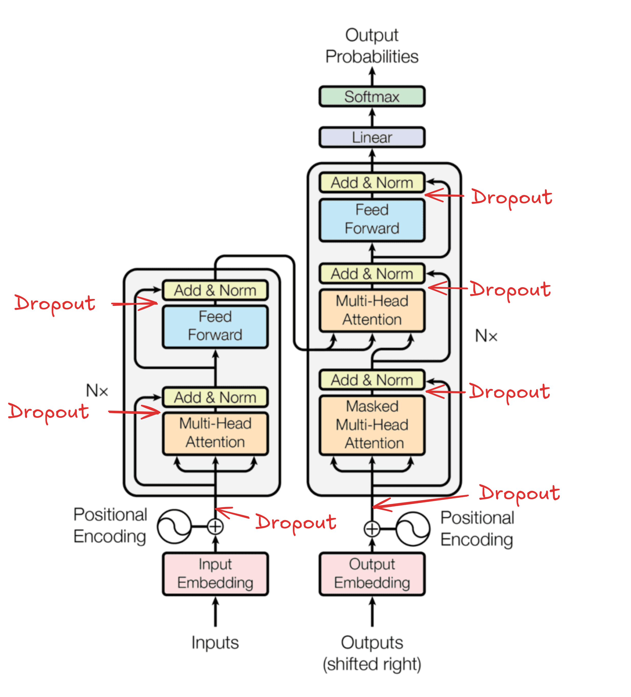

# TransformerForDummies :rocket:
When I started to study the Transformer model, I found that some important details of the model implementation were not totally clear and I needed to search for other implementations or explanations of these details.

For this reason, I decided to report some clarifications for the most important doubts that I had, hoping that this could help some other researchers!

These explanations assume a basic knowledge of the transformer models (e.g. Encoder-Decoder architecture, Multi-Head  Attention Mechanism, tokenization, etc.), avoiding creating a redundant repository over millions already present on the web. In this way, I can focus specifically on the ambiguities.

This Repo offers:

#### 1. This README.md file with all the explained ambiguities that I found;
#### 2. A complete, clear, and commented implementation of the Transformer model in Pytorch and Pytorch Lightning.


## The Architecture :tada: 
The very well-known image that depicts the transformer architecture hides a lot of important information that is useful for the correct implementation.
<p align="center">

</p>

Some of the first questions that came up in my mind when I had a look at this picture were:
### 1) **How the Encoder and Decoder are connected?**

The encoder and the decoder can have multiple layers (N as reported). The output of the encoder seems to be connected to the decoder. 
But! Into which layer?? The last one, the first one?? All of them??

### <center>**The Encoder Output is brought to ALL the Decoder Layers**</center>
As reported in:

<p align="center">

</p>

Picture taken by (https://www.truefoundry.com/blog/transformer-architecture)

### 2) **How is the encoder's output connected to the 'Multi-Head Attention of the Decoder'?**
Every attention block has three inputs that should Query, Key, and Value. Which one is what??

###  <p align=center>**The Keys and the Values come from the Encoder, the Queries come from the last sublayer of the decoder.**</p>

<p align="center">

</p>

Both the above answers could be extracted with a bit of interpretation from:
<p align="center">

</p>
Notice the phrase: 

*This allows every position in the decoder to attend over all the positions in the input sequence*, this sentence will also be useful later.


### 3) **What's the difference between the three different attention blocks?**

In the rest of the README we'll call:
- **Self-Attention block** of the encoder: the attention block of the encoder (of course :) )
- **Masked-Self-Attention block** of the decoder: you got it!
- **Cross-Attention block**: the block where the encoder is connected to the decoder.

Later a more detailed answer!

## The Masks :collision:

I admit that I struggled a bit to understand well how the masking is used in this model, mainly because a looot of things are given for granted, and appear clear and obvious only when you start to implement things and problems come up.

### 1) **How the mask is included in the Masked-Self-Attention block of the decoder?**

### The Look-Ahead/Causal Mask

First of all, I would have named the "Look Ahead Mask" as the "DON'T Look Ahead Mask". This mask is used by the decoder to allow the computation of attention only backward in the sentence.

Yes, it makes sense, but why?? Well, because at the inference time, the decoder will act in an auto-regressive manner, which means that it only has the encoder's input as a complete sentence, and the decoder should generate a word at a time during inference. Hence, only using the already generated words. For this reason, we need to force at training time to learn to predict the ground-truth output sentence without looking at the next words, otherwise, that's cheating!

Here we report the shape of the "Don't look ahead mask" also called "Causal Mask":
$M^C \in \mathbb{R}^{L x L}$

$$M^C = \begin{bmatrix} 
0 & -\infty & -\infty &  -\infty & -\infty &  -\infty  \\\
0 & 0 & -\infty & -\infty & -\infty & -\infty \\\
0 & 0 & 0 & -\infty & -\infty & -\infty \\\
0 & 0 & 0 & 0 & -\infty & -\infty \\\
0 & 0 & 0 & 0 & 0 & -\infty \\\
0 & 0 & 0 & 0 & 0 & 0 
\end{bmatrix}
$$

Notice that the size of the mask is $L \times L$ which is the length of the sentence. 

The matrix is composed of zeros and $-\infty$, we'll see in a moment why.

### **The computation of the masked attention is then**:


$$
    \mathop{\text{Attention}}(Q, K, V) = \mathop{\text{Softmax}}\bigg(\frac{QK^{T}}{\sqrt{d_k}} + M^C\bigg)V
$$

Notice the mask is inside the softmax function.

This is done because if we consider $Q \in \mathbb{R}^{L \times 1}, K \in \mathbb{R}^{L \times 1}, V \in \mathbb{R}^{L \times 1}$. We would have $QK^{T} \in \mathbb{R}^{L \times L}$

Now, **the $\mathop{\text{Softmax}}$ function is applied row-wise**, this is just because the later multiplication with $V$ is on the right-hand side.

Remind that $\mathop{\text{Softmax}}(x_i) = \frac{e^{x_i}}{\sum_i e^{x_i}}$, where the $x_i$ is in a set $X = {x_1, x_2, ..., x_n}$, this function just reweights the value to be summed to 1.

Hence, when the value is $-\infty$ the softmax gives a weight of $0$ that means "don't consider this value".

With an example everything is always clearer!

$$Q = K = V = \begin{bmatrix}1 \\\
2 \\\
3 \\\
4 \\\
5 \\\
6 \end{bmatrix} \in \mathbb{R}^{L \times 1}, L = 6
$$

$$QK^{T} = \begin{bmatrix} 1 \\\
2 \\\
3 \\\
4 \\\
5 \\\
6 \end{bmatrix} * \begin{bmatrix} 1 & 2 & 3 & 4 & 5 & 6 \end{bmatrix} \\
= \begin{bmatrix} 1 & 2 & 3 & 4 & 5 & 6 \\\ 
2 & 4 & 6 & 8 & 10 & 12 \\\
3 & 6 & 9 & 12 & 15 & 18 \\\
4 & 8 & 12 & 16 & 20 & 24  \\\ 
5 & 10 & 15 & 20 & 25 & 30\\\
6 & 12 & 18 & 24 & 30 & 36 
\end{bmatrix}$$

That of course is simmetric. Moreover, we have that $QK^{T} = \frac{QK^{T}}{\sqrt{d_k}}$ where $d_k$ is just the dimension of the single vector that in our example is just 1.

$$\frac{QK^{T}}{\sqrt{d_k}} = \begin{bmatrix} 1 & 2 & 3 & 4 & 5 & 6 \\\ 
2 & 4 & 6 & 8 & 10 & 12 \\\
3 & 6 & 9 & 12 & 15 & 18 \\\
4 & 8 & 12 & 16 & 20 & 24  \\\ 
5 & 10 & 15 & 20 & 25 & 30\\\
6 & 12 & 18 & 24 & 30 & 36 
\end{bmatrix}$$

$$\frac{QK^{T}}{\sqrt{d_k}} + M^C = \begin{bmatrix} 
1 & -\infty & -\infty & -\infty & -\infty &  -\infty  \\\
2 & 4 & -\infty & -\infty & -\infty & -\infty \\\
3 & 6 & 9 & -\infty & -\infty & -\infty \\\
4 & 8 & 12 & 16 & -\infty &  -\infty\\\
5 & 10 & 15 & 20 & 25 & -\infty  \\\
6 & 12 & 18 & 24 & 30 & 36 
\end{bmatrix}$$

Now we need to apply the **softmax function ROW-WISE**. Why row-wise? because remember that we are using column vectors:
$Q = K = V \in \mathbb{R}^{L \times 1}$ for this reason after the softmax we have $\mathop{\text{Softmax}}(\frac{QK^T}{\sqrt{d_k}}) \in \mathbb{R}^{L \times L}$ that multiplied by $V \in \mathbb{R}^{L \times 1}$ we have a new column vector $A \in \mathbb{R}^{L \times 1}$ ( $(L \times L) \times (L \times 1) = L \times (L \times L) \times 1 = L \times 1$ )


### ACHTUNG :anger:

#### 1. The softmax function is numerically unstable for $-\infty$. For this reason, we need to modify $-\infty$ values in a VERY HIGH NEGATIVE VALUE like -1E15;
#### 2. The softmax function is applied "for each row"! But remember how Pytorch handles the dimensions!

This could be trivial for the practitioners but it's important to explicate everything (the repo is called **TransformerForDummies** after all :D)

First of all, remember what the "dimensions" mean in pytorch: dim = 0, means that you are indexing through the rows! Dim = 1  means that you are indexing through the columns.
<p align="center">

</p>

However, the Pytorch documentation of the softmax function reports:
<p align="center">

</p>

That in this case means that every row will be "collapsed" independently to compute the softmax.
Hence, after the:

```python
values = torch.softmax(values, dim=-1)
```
Using the last dimension! That in our case will be all the whole rows!

We'll have:

$$
    \mathop{\text{Softmax}}\bigg(\frac{QK^{T}}{\sqrt{d_k}} + M^C\bigg) = \begin{bmatrix} 
1.0000e+00 & 0 & 0 & 0 & 0 &  0  \\\
1.1920e-01 & 8.8080e-01 & 0 & 0 & 0 & 0\\\
2.3556e-03 & 4.7314e-02 & 9.5033e-01 & 0 & 0 & 0\\\
6.0317e-06 & 3.2932e-04 & 1.7980e-02 & 9.8168e-01 & 0 &  0 \\\
2.0473e-09 & 3.0384e-07 & 4.5094e-05 & 6.6925e-03 & 9.9326e-01 & 0  \\\
9.3344e-14 & 3.7658e-11 & 1.5192e-08 & 6.1290e-06 &  2.4726e-03 & 9.9752e-01
\end{bmatrix}
$$

The sum "for each row" is always 1.0, try to believe!

Finally, we can compute the output values of the attention mechanism:

$$\mathop{\text{Softmax}}\bigg(\frac{QK^{T}}{\sqrt{d_k}} + M^C\bigg)V = \begin{bmatrix} 
1.0000e+00 & 0 & 0 & 0 & 0 &  0  \\\
1.1920e-01 & 8.8080e-01 & 0 & 0 & 0 & 0\\\
2.3556e-03 & 4.7314e-02 & 9.5033e-01 & 0 & 0 & 0\\\
6.0317e-06 & 3.2932e-04 & 1.7980e-02 & 9.8168e-01 & 0 &  0 \\\
2.0473e-09 & 3.0384e-07 & 4.5094e-05 & 6.6925e-03 & 9.9326e-01 & 0  \\\
9.3344e-14 & 3.7658e-11 & 1.5192e-08 & 6.1290e-06 &  2.4726e-03 & 9.9752e-01
\end{bmatrix} * \begin{bmatrix} 1 \\\ 2 \\\ 3 \\\ 4 \\\ 5 \\\ 6\end{bmatrix}$$

The results is:

$$\mathop{\text{Attention}}(Q, V, K) = \begin{bmatrix}
    1.0\\\
    1.8808 \\\
    2.9480 \\\
    3.9813 \\\
    4.9932 \\\
    5.9975
    \end{bmatrix}$$

This new vector represents a weighted combination of the values of  $V$, in fact, the first component considers only the first value, the second component is the weighted sum of the first two components, and so on...
### The Padding Mask

The Padding mask could seem trivial at first sight, but it has its own quibbles. The first reason why it is necessary is that **not all the sentences have the same length!**
We:
- **Add Padding tokens to bring all the sentences to have the same length;**
- **Create a mask that "block" the softmax function to consider this token that are uninformative.**

## The padding Mask: requires a paragraph for itself... :fire:
### 1) What if I do not want to use multiple sentences?? (BATCH SIZE = 1)?

### ***<p align=center>In this case we don't need a padding mask</p>***

### 2) Wait? But the encoder's input and the decoder's input can have different lengths? What about the padding then?

### ***<p align=center>The two inputs can have a different lengths. </p>***

Let's assume that we have the batch size equal to 1, the encoder output is $X \in \mathbb{R}^{L_1 \times E}$ and the input of the decoder is $Y \in \mathbb{R}^{L_2 \times E}$ (the same dimensionality of the input of the decoder is reported till the point of the conjunction of the two, that is the "Cross-Attention"), where $L_1$ is the length of the sentence in the encoder, $L_2$ is the length of the sentence in the decoder, $E$ is the embedding size.

First of all, the $E$ should be the same for the encoder and the decoder, if it is not obvious now, it will be in a second.

About the two sequence lengths instead, we remind from the answer 2, that the decoder offers the query to the attention, the encoder the keys, and the values instead. Hence, $Q \in \mathbb{R}^{L_2 \times E}, K \in \mathbb{R}^{L_1 \times E}, V \in \mathbb{R}^{L_1 \times E}$

$$\frac{QK^{T}}{\sqrt{|E|}} \in \mathbb{R}^{(L_2 \times E) \times (E \times L_1)} = \mathbb{R}^{L_2 \times L_1}$$

This first explains why the embedding size should be equal for the both encoder and the decoder (basic linear algebra).

Then, after the attention computation:

$$\mathop{\text{Softmax}}(\frac{Q_{d}K_{e}^{T}}{\sqrt{|E|}})V_{e} \in \mathbb{R}^{(L_2 \times L_1) \times (L_1 \times E)} = \mathbb{R}^{L_2 \times E}$$

where the pedices $e$ and $d$ denote the encoder and the decoder respectively, since we're talking about the Cross-Attention block.
So,
### ***<p align=center>In this case the decoder's output will have the same decoder's input length. </p>***

From a practical point of view though, we need to understand when have different lengths is convenient, necessary or else:
- *Training*: 
  - During the training, the batch size is larger than 1, so the padding _IS NECESSARY_;
  -	In theory, it is also possible to create batches for the encoder and the decoder of different lengths (sequence lengths, not the batch size of course). This can be annoying from the implementation point of view, but it could be convenient if there is a large difference in the lengths of the sequences between the two languages (if we consider a translation  task);
  - In practise during the training, the dataloader is often implemented using the same lengths for the encoder's and decoder's inputs.
- *Inference*:
  - At inference time (manually testing the model for example) we often use just one input, in this case, we don't need the padding since the batch size = 1.
  - On the other hand, if we implemented the model in such a way it is possible to have different sizes of the encoder's input and output, we don't even need the padding for the input.

Recap:
- The padding is used for two reasons:
  - Aligning the sequences for the same batch;
  - Aligning the sequences between the two batches of encoder and decoder (depends on the implementation).

### 4) What is the shape of the padding Mask? How is it employed?

First, if we want to talk about padding mask we need to consider the Batch size > 1 that we'll name $B$. Hence, $Q \in \mathbb{R}^{B \times L \times E}, K \in \mathbb{R}^{B \times L \times E}, V \in \mathbb{R}^{B \times L \times E}$, $L$ is the sequence length and $E$ is the embedding size.

Now, we'll use an arbitrary value for the padding token $[\text{PAD}]$, to align all the $|B|$ sequences to the same length $L$. 

As an example, the "proto-padding-mask" where $|B| = 4$ and $|L| = 6$, will be:

$$|B| \underbrace{\begin{bmatrix} x_1 & x_2 & [\text{PAD}] & [\text{PAD}] & [\text{PAD}] & [\text{PAD}] \\\
    x_3 & x_4 & x_5 & x_6 & [\text{PAD}] & [\text{PAD}] \\\
x_7 & x_8 & x_9 & [\text{PAD}] & [\text{PAD}] & [\text{PAD}] \\\
x_{10} & x_{11} & x_{12} & x_{13}] & x_{14} & [\text{PAD}] 
\end{bmatrix}}_{|L|}$$

Remember that the scaled-dot-product attention function with a generic mask is:

$$
    \mathop{\text{Attention}}(Q, K, V) = \mathop{\text{Softmax}}(\frac{QK^{T}}{\sqrt{d_k}} + M)V
$$

for the operation $QK^{T}$ the transposition for the tensor $K$ is done only on the last two dimensions (the batch dim is not considered), so 

$$QK^{T} \in \mathbb{R}^{(B \times L \times E) \times (B \times E \times L) } = \mathbb{R}^{B \times L \times L}
$$

Now, for each sentence in the set of size $|B|$ we have a $L \times L$ matrix that should be masked. 
To better understand how to construct our padding mask we can make and example with a single sentence, let's say the third row!

$$Q = K = \begin{bmatrix}x_7 \\\
x_8 \\\
x_9 \\\
[\text{PAD}] \\\
[\text{PAD}] \\\ 
[\text{PAD}] \end{bmatrix}\in \mathbb{R}^{1xLxE}$$

Considering every element like $x_7 \in \mathbb{R}^{E}$. So,

$$QK^{T} = \begin{bmatrix}x_7 \\\
x_8 \\\
x_9 \\\
[\text{PAD}] \\\
[\text{PAD}] \\\ 
[\text{PAD}] \end{bmatrix} * \begin{bmatrix}x_7 & x_8 & x_9 & [\text{PAD}] & [\text{PAD}] & [\text{PAD}] \end{bmatrix} = \begin{bmatrix} x_7x_7 & x_7x_8 & x_7x_9 & x_7[\text{PAD}] & x_7[\text{PAD}] & x_7[\text{PAD}] \\\
x_8x_7 & x_8x_8 & x_8x_9 & x_8[\text{PAD}] & x_8[\text{PAD}] & x_8[\text{PAD}] \\\
x_9x_7 & x_9x_8 & x_9x_9 & x_9[\text{PAD}] & x_9[\text{PAD}] & x_9[\text{PAD}] \\\
[\text{PAD}]x_7 & [\text{PAD}]x_8 & [\text{PAD}]x_9 & [\text{PAD}][\text{PAD}] & [\text{PAD}][\text{PAD}] & [\text{PAD}][\text{PAD}] \\\
[\text{PAD}]x_7 & [\text{PAD}]x_8 & [\text{PAD}]x_9 & [\text{PAD}][\text{PAD}] & [\text{PAD}][\text{PAD}] & [\text{PAD}][\text{PAD}] \\\
[\text{PAD}]x_7 & [\text{PAD}]x_8 & [\text{PAD}]x_9 & [\text{PAD}][\text{PAD}] & [\text{PAD}][\text{PAD}] & [\text{PAD}][\text{PAD}] 
\end{bmatrix}
$$

It's easy to see that every position in which we have a multiplication by the padding token (actually a dot product because every entry is $\in \mathbb{R}^{E}$) should be masked.

Hence, our padding mask for the third sentence will be:

$$
    M^{P}_3 = \begin{bmatrix} 0 & 0 & 0 & -\infty & -\infty & -\infty \\\
0 & 0 & 0 & -\infty & -\infty & -\infty \\\
0 & 0 & 0 & -\infty & -\infty & -\infty \\\
-\infty & -\infty & -\infty & -\infty & -\infty & -\infty \\\
-\infty & -\infty & -\infty & -\infty & -\infty & -\infty  \\\
-\infty & -\infty & -\infty & -\infty & -\infty & -\infty  
\end{bmatrix}
$$

It's easy to derive this mask with these operations:

```python
B = 1
L = 6
padding_mask = torch.FloatTensor([False, False, False, False, True, True]).unsqueeze(0).unsqueeze(0)
padding_mask_right = padding_mask.repeat(1, L, 1)
padding_mask_left = padding_mask_right.transpose(-1, -2)
padding_mask = (padding_mask_left | padding_mask_right).float()
padding_mask[padding_mask == 1.] = -torch.inf
```
but I'm pretty sure more efficient ways exists. 
It's important to notice also from the implementation, that the padding mask is like it is composed by two masks. This is because $Q$ and $K^T$ are vector with each having its own padding mask. 
In this case the two vectors are the same so the resulting padding mask is simmetric.


Hence, we'll have a different Padding mask for each sentence. 

$$M^{P} = \[ M^{P}_1, ..., M^{P}_B \]$$

### 3) Ok, but the Transformer has 3 attention blocks in which one I should insert the padding mask?

This is probably one of the hardest question I had to find an answer to. Let's start from the most trivial things. The Masked-Self-Attention block of course needs the Causal Mask, and that's ok. However, the most reasonable thing is that both the Self-attention block of the encoder, and Masked-Self-Attention block of the Decoder, also need a padding Mask.
This is because as reported in the article:

- _"The encoder contains self-attention layers. In a self-attention layer all of the keys, values
and queries come from the same place, in this case, the output of the previous layer in the
encoder. Each position in the encoder **can attend to all positions** in the previous layer of the
encoder."_
- _"Similarly, self-attention layers in the decoder allow each position in the decoder **to attend to
all positions** in the decoder up to and including that position. We need to prevent leftward
information flow in the decoder to preserve the auto-regressive property. We implement this
inside of scaled dot-product attention by masking out (setting to −∞) all values in the input
of the softmax which correspond to illegal connections. See Figure 2"_

When in the article is mentioned that the self-attention blocks should attend to "all the positions", it's reasonable to think that only the meaningful part should be attended, so excluding the padding token. 
Hence, until now we have: Encoder's Self-Attention block needs the Padding Mask; the Decoder's Masked-Self-Attention block needs padding Mask + Causal Mask.

#### Perfect! **But what about the Cross-Attention block in the decoder?** 

The article reports:

<p align="center">

</p>

So, if we need to consider the same rational where "all the positions" means all the meaningful positions, Do we need to combine two padding masks??,
the encoder and the decoder's one, also considering that Queries come from the decoder and the Keys from the encoder?? However, since I didn't want to speculate much, I needed to investigate more.

First of all, I found that the same question has been asked a lot around the web, but few time I've seen a reasonable answer: [HERE](https://medium.com/@sxyxiaoyao/i-have-a-question-about-this-line-code-why-we-need-memory-mask-in-decoder-ab7d5a9e8060) [HERE](https://github.com/pytorch/pytorch/issues/124931) [HERE](https://stackoverflow.com/questions/62170439/difference-between-src-mask-and-src-key-padding-mask) [HERE](https://medium.com/@bavalpreetsinghh/transformer-from-scratch-using-pytorch-28a5d1b2e033) [HERE](https://datascience.stackexchange.com/questions/65067/proper-masking-in-the-transformer-model) [HERE](https://datascience.stackexchange.com/questions/88097/why-do-transformers-mask-at-every-layer-instead-of-just-at-the-input-layer) [HERE](https://ai.stackexchange.com/questions/25041/is-the-decoder-mask-triangular-mask-applied-only-in-the-first-decoder-block-o)

Unfortunately, not all the answer were clear and agreed to each other. In spite of this, I tried to have my own answer, mainly based on these factors:

- The official Pytorch Implementation of the Transformer model has as parameter the **_memory_mask_** [HERE](https://pytorch.org/docs/stable/generated/torch.nn.Transformer.html)
- [This article](https://medium.com/@bavalpreetsinghh/transformer-from-scratch-using-pytorch-28a5d1b2e033) reports that it is necessary to avoid conflict. Which conflict? Not explained.
- [This](https://stackoverflow.com/questions/62170439/difference-between-src-mask-and-src-key-padding-mask) instead reports that the memory mask is just the same as the encoder-input's Padding mask, so in general applied to the Keys. Ok, but why?

Ok, my catch on this is: 
1. The Cross-Attention block needs a padding Mask; 
2. In the official implementations there is what is called Memory Mask that seems to be a copy of the encoder's input padding mask; 
3. I haven't found anything about the inclusion of the decoder's input padding mask.

However, I wasn't satisfied with this. I had to prove the sense by myself. 

So, let's start with and example where queries come from the decoder, and the keys and values are the same vector from the encoder output.

$Q_d \in \mathbb{R}^{L_2 \times E}, K_e^T \in \mathbb{R}^{E \times L_1}, V_e \in \mathbb{R}^{L_1 \times E}$ with $E = 1$

$$Q_d = \begin{bmatrix}
    1\\\
    2 \\\
    3 \\\
    [\text{null}_d] \\\
    [\text{null}_d] \\\
    [\text{null}_d]
    \end{bmatrix}; K_e^T = \begin{bmatrix} 4 & 5 & 6 & 7 & [\text{null}_e] & [\text{null}_e]\end{bmatrix};  V_e = \begin{bmatrix}
    4\\\
    5 \\\
    6 \\\
    7 \\\
    [\text{null}_e] \\\
    [\text{null}_e]
    \end{bmatrix};$$


$$Q_dK_e^T = \begin{bmatrix} 4 & 5 & 6 & 7 & 1*[\text{null}_e] & 1*[\text{null}_e] \\\
     8 & 10 & 12 & 14 & 2*[\text{null}_e] & 2*[\text{null}_e] \\\
     12 & 15 & 18 & 21 & 3*[\text{null}_e] & 3*[\text{null}_e] \\\
     [\text{null}_d] * 4 & [\text{null}_d] * 5 & [\text{null}_d] * 6 & [\text{null}_d] * 7 & [\text{null}_d] * [\text{null}_e] & [\text{null}_d] * [\text{null}_e] \\\
    [\text{null}_d] * 4 & [\text{null}_d] * 5 & [\text{null}_d] * 6 & [\text{null}_d] * 7 & [\text{null}_d] * [\text{null}_e] & [\text{null}_d] * [\text{null}_e]  \\\
    [\text{null}_d] * 4 & [\text{null}_d] * 5 & [\text{null}_d] * 6 & [\text{null}_d] * 7 & [\text{null}_d] * [\text{null}_e] & [\text{null}_d] * [\text{null}_e]\end{bmatrix}$$

Where $\text{null}_d$ or $\text{null}_e$ represent the values in the vector correspondent to the Padding values of decoder and encoder respectively.

Now let's consider the three possibilities for the Padding mask: encoder's input Padding mask, decoder's input padding mask, combination of both.
More precisely, since the computation of the $Q_dK_e^T$ have the query from the decoder and the keys from the encoder, we'll call  the "left decoder's input Padding mask" and "right encoder's input Padding mask" respectively.

$$M_e^{\text {right }} = \begin{bmatrix} 0 & 0 & 0 & 0 & -\infty & -\infty\\\
 0 & 0 & 0 & 0 & -\infty & -\infty \\\
0 & 0 & 0 & 0 & -\infty & -\infty \\\
0 & 0 & 0 & 0 & -\infty & -\infty \\\
0 & 0 & 0 & 0 & -\infty & -\infty \\\
0 & 0 & 0 & 0 & -\infty & -\infty 
\end{bmatrix}
$$

$$M_d^{\text{left}} = \begin{bmatrix} 0 & 0 & 0 & 0 & 0 & 0\\\
 0 & 0 & 0 & 0 & 0 & 0 \\\
0 & 0 & 0 & 0 & 0 & 0 \\\
-\infty & -\infty & -\infty & -\infty & -\infty & -\infty  \\\
-\infty & -\infty & -\infty & -\infty & -\infty & -\infty  \\\
-\infty & -\infty & -\infty & -\infty & -\infty & -\infty 
\end{bmatrix}
$$

$$M_d^{\text{left}} +  M_e^{\text {right }}  = \begin{bmatrix} 0 & 0 & 0 & 0 & -\infty & -\infty\\\
 0 & 0 & 0 & 0 & -\infty & -\infty\\\
0 & 0 & 0 & 0 & -\infty & -\infty \\\
-\infty & -\infty & -\infty & -\infty & -\infty & -\infty  \\\
-\infty & -\infty & -\infty & -\infty & -\infty & -\infty  \\\
-\infty & -\infty & -\infty & -\infty & -\infty & -\infty 
\end{bmatrix}
$$

Ok, now let's apply the three possibilities, and see what happens.

#### Right Encoder's input padding mask

$$\frac{Q_{d}K_{e}^{T}}{\sqrt{d_k}} + M_e^{\text {right }}  = \begin{bmatrix} 4 & 5 & 6 & 7 & -\infty & -\infty \\\
 8 & 10 & 12 & 14 & -\infty & -\infty \\\
 12 & 15 & 18 & 21 & -\infty & -\infty \\\
 [\text{null}_d]*4 & [\text{null}_d]*5 & [\text{null}_d]*6 & [\text{null}_d]*7 & -\infty & -\infty \\\
[\text{null}_d]*4 & [\text{null}_d]*5 & [\text{null}_d]*6 & [\text{null}_d]*7 & -\infty & -\infty  \\\
[\text{null}_d]*4 & [\text{null}_d]*5 & [\text{null}_d]*6 & [\text{null}_d]*7 & -\infty & -\infty 
\end{bmatrix}
$$

$$\mathop{\text{Softmax}}(\frac{Q_{d}K_{e}^{T}}{\sqrt{d_k}} + M_e^{\text {right }})V_e = \begin{bmatrix} 0.0321 & 0.0871 & 0.2369 & 0.6439 & 0 & 0 \\\
0.0021 & 0.0158 & 0.1171 & 0.8650 & 0 & 0 \\\
 1.1727e-04 &  2.3554e-03 & 4.7309e-02 & 9.5022e-01 & 0 & 0\\\
 w_1^{null} & w_2^{null} & w_3^{null} & w_4^{null} & 0 & 0 \\\
w_5^{null} & w_6^{null} & w_7^{null} & w_8^{null} & 0 & 0   \\\
w_9^{null} & w_{10}^{null} & w_{11}^{null} & w_{12}^{null} & 0 & 0 
\end{bmatrix}* \begin{bmatrix}
    4\\\
    5 \\\
    6 \\\
    7 \\\
    [\text{null}_d] \\\
    [\text{null}_d]
    \end{bmatrix} \\
 = \begin{bmatrix} 6.4926 \\\
6.845 \\\
6.9476 \\\
W_1^{null} \\\
W_2^{null} \\\
W_3^{null}
\end{bmatrix}
$$

Where $w_x^{null}$ represent a weight from a non-relevant position and $W_x^{null}$ represent a dot product out of a matrix multiplication that contains some $w_x^{null}$ values.
As it is possible to see the output vector contains at the end some values that represent the padding.

#### Left Decoder's input padding mask

$$\frac{Q_{d}K_{e}^{T}}{\sqrt{d_k}} + M_d^{\text{left}} = \begin{bmatrix} 4 & 5 & 6 & 7 & 1*[\text{null}_e] & 1*[\text{null}_e] \\\
 8 & 10 & 12 & 14 & 2*[\text{null}_e] & 2*[\text{null}_e] \\\
 12 & 15 & 18 & 21 & 3*[\text{null}_e] & 3*[\text{null}_e] \\\
-\infty & -\infty & -\infty & -\infty & -\infty & -\infty  \\\
-\infty & -\infty & -\infty & -\infty & -\infty & -\infty  \\\
-\infty & -\infty & -\infty & -\infty & -\infty & -\infty 
\end{bmatrix}
$$

$$\mathop{\text{Softmax}}(\frac{Q_{d}K_{e}^{T}}{\sqrt{d_k}} + M_d^{\text{left}} )V_e = \begin{bmatrix} w_1^{dirty} & w_2^{dirty} & w_3^{dirty} & w_4^{dirty} & w_5^{null} & w_6^{null} \\\
w_1^{dirty} & w_2^{dirty} & w_3^{dirty} & w_4^{dirty} & w_5^{null} & w_6^{null} \\\
w_1^{dirty} & w_2^{dirty} & w_3^{dirty} & w_4^{dirty} & w_5^{null} & w_6^{null} \\\
0.1666 & 0.1666 & 0.1666 & 0.1666 & 0.1666 & 0.1666  \\\
0.1666 & 0.1666 & 0.1666 & 0.1666 & 0.1666 & 0.1666  \\\
0.1666 & 0.1666 & 0.1666 & 0.1666 & 0.1666 & 0.1666 
\end{bmatrix} * \begin{bmatrix}
    4\\\
    5 \\\
    6 \\\
    7 \\\
    [\text{null}_d] \\\
    [\text{null}_d]
    \end{bmatrix} = \begin{bmatrix} W_1^{dirty} \\\
W_2^{dirty} \\\
W_3^{dirty} \\\
W_4^{null} \\\
W_5^{null} \\\
W_6^{null}
\end{bmatrix}
$$

Here I called $w_x^{dirty}$ the weights values out of the softmax computed also using some values from the padding positions. 
As it is possible to see the output in this case is composed by "dirty" values and null values.

Finally, the combination of both the padding masks.
#### Both Encoder's and  Decoder's input padding mask

$$
\frac{Q_{d}K_{e}^{T}}{\sqrt{d_k}} + M_d^{\text{left}} + M_e^{\text {right }} = \begin{bmatrix} 4 & 5 & 6 & 7 & -\infty & -\infty \\\
 8 & 10 & 12 & 14 & -\infty & -\infty \\\
 12 & 15 & 18 & 21 & -\infty & -\infty \\\
-\infty & -\infty & -\infty & -\infty & -\infty & -\infty  \\\
-\infty & -\infty & -\infty & -\infty & -\infty & -\infty  \\\
-\infty & -\infty & -\infty & -\infty & -\infty & -\infty 
\end{bmatrix}
$$
$$
\mathop{\text{Softmax}}(\frac{Q_{d}K_{e}^{T}}{\sqrt{d_k}} + M_d^{\text{left}} + M_e^{\text {right }})V_e = \begin{bmatrix} 0.0321 & 0.0871 & 0.2369 & 0.6439 & 0 & 0 \\\
0.0021 & 0.0158 & 0.1171 & 0.8650 & 0 & 0 \\\
 1.1727e-04 &  2.3554e-03 & 4.7309e-02 & 9.5022e-01 & 0 & 0\\\
0.1666 & 0.1666 & 0.1666 & 0.1666 & 0.1666 & 0.1666  \\\
0.1666 & 0.1666 & 0.1666 & 0.1666 & 0.1666 & 0.1666  \\\
0.1666 & 0.1666 & 0.1666 & 0.1666 & 0.1666 & 0.1666 
\end{bmatrix} * \begin{bmatrix}
    4\\\
    5 \\\
    6 \\\
    7 \\\
    [\text{null}_d] \\\
    [\text{null}_d]
    \end{bmatrix} = \begin{bmatrix} 6.4926 \\\
6.845 \\\
6.9476 \\\
W_1^{null} \\\
W_2^{null} \\\
W_3^{null}
\end{bmatrix}
$$

### Finally we have our answer!
First!

$$\mathop{\text{Softmax}}(\frac{Q_{d}K_{e}^{T}}{\sqrt{d_k}} + M_d^{left} + M_e^{\text {right }})V_e = \mathop{\text{Softmax}}(\frac{Q_{d}K_{e}^{T}}{\sqrt{d_k}} + M_e^{\text {right }})V_e$$

Using the decoder's input padding mask would create dirty values. Hence, using the right encoder's input padding mask is the best choice. 
Not using any padding mask for the Cross-Attention block would create dirty values. 

Just to experimentally validate this assertion I trained a simple Transformer model and I found that with the right padding mask for the Cross-Attention block leads to better validation accuracy respect to not using any.
(7.154 vs 7.3 of Validation loss after 1 epoch)

## padding Mask Usage Recap:

#### - **Encoder Self-Attention block wants: ENCODER'S INPUT padding MASK**
#### - **Decoder MASKED Self-Attention block wants: DECODER'S INPUT padding MASK + CAUSAL MASK**
#### - **Encoder-Decoder Cross-Attention block wants: ENCODER'S INPUT padding MASK**

<p align="center">

</p>


### Recap for the Masking

#### - Self-Attention Encoder block: 

$$\mathop{\text{SelfAttention}}(Q_{e}, K_{e}, V_{e}) = \mathop{\text{Softmax}}(\frac{Q_{e}K_{e}^{T}}{\sqrt{d_k}} + M_e^{P})V_{e}$$

$M_e^{P} = M_e^{\text{left}} + M_e^{\text {right }}$ that is $M_e^{\text{left}} = M_e^{\text{right}^T}$
#### - Decoder MASKED Self-Attention block:

$$\mathop{\text{MaskedSelfAttention}}(Q_{d}, K_{d}, V_{d}) = \mathop{\text{Softmax}}(\frac{Q_{d}K_{d}^{T}}{\sqrt{d_k}} + M_d^{P} + M^{C})V_{d}$$

$M_d^{P} = M_d^{\text{left}} + M_d^{\text {right }}$ that is $M_d^{\text{left}} = M_d^{\text {right }^T}$
#### - Encoder-Decoder Cross-Attention block: 

$$\mathop{\text{CrossAttention}}(Q_{d}, K_{e}, V_{e}) = \mathop{\text{Softmax}}(\frac{Q_{d}K_{e}^{T}}{\sqrt{d_k}} + M_e^{\text {right }})V_{e}$$

Where the pedices $e$ or $d$ in this case stand for Encoder and Decoder. $M^P$ is the padding Mask, $M^C$ is the Causal Mask, $d_k$ is the embedding dimension that in our case is $E$, (in whole in example we didn't mention the different heads).

## The Embeddings :grey_question:

### 1) How the embeddings layers are implemented?

The embeddings layer are used to map each token into a vector. 

To allow this it's easy to just use the *torch.nn.Embedding(num_embeddings, embedding_dim, ...)* class. Internally the class is just a linear layer that maps an integer into a vector. Still more under the hood, each integer is considered in one-hot-encoding.

Hence, the parameters will be:
- num_embeddings = VOCABULARY SIZE
- embedding_dim = EMBEDDING SIZE

Unfortunately for this reason, the embedding layer is one of the storage heavy part of the model. Let's make an example:
VOCABULARY SIZE = 50k and EMBEDDING SIZE = 512, we'll have a linear layer of $512 \times 50'000 = 25,6*10^6$ parameters, that are more than 25,6 millions of parameters. 

Moreover, considering that we have two different embeddings layers ( one for the encoder and one for the decoder), we have more than 50 millions parameters just for the first step of the processing.
Remind that this layer is trainable.
## The last layer of the Decoder :fearful:

Even if this part is almost straightforward, in the paper is the most ambiguous one. 

It's intuitive that we just need a linear layer and a softmax to have a "vocabulary-sized" vector of probabilities to sample the most probable next word.
However, let's read:

<p align="center">

</p>

We first read
- *[...], **we share the same weight matrix between the two embedding layers and the pre-softmax
linear transformation**, [...].*

Wait Wait Wait!
- I can accept a weights sharing between the embedding layer of the Decoder and its last layer, because maybe we just want to save some parameters and because the vocabulary for the target sentence in the decoder is the same in output of course...
- But WHY?? It should be shared with the Encoder's embedding layer, that probably will have a different vocabulary, since this model is generally considered for a task like Translation??? Am I missing something? :confounded:

I searched a lot and I found one only sensed answer, thanks to 'noe' on Datascience.Stackexchange:

- *The source and target embeddings can be shared or not. This is a design decision. They are normally shared if the token vocabulary is shared, and this normally happens when you have languages with the same script (i.e. the Latin alphabet). If your source and target languages are e.g. English and Chinese, which have different writing systems, your token vocabularies would probably not be shared, and then the embeddings wouldn't be shared either. NOE*

- *Then, the linear projection before the softmax can be shared with the target embedding matrix. This is also a design decision. It is frequent to share them. NOE*

uff...okok I took a sigh of relief, it was as I thought, just a task dependent design choice.

For the all answer refer [HERE](https://datascience.stackexchange.com/questions/84930/weights-shared-by-different-parts-of-a-transformer-model "Why sharing weights") 

Hence, my recap is:

#### 1. Decoder Embedding Layer and final Linear Layer before the softmax share the weights;

This is actually a design choice also to reduce the computation.

#### 2. Encoder Embedding Layer and Decoder Embedding Layer can share the weights in the case the source and the target languages are the same.

So, in this case all the three layer share the same weights as reported in the article.

Ok, let's continue to read:

- **[...] In the embedding layers, we multiply those weights by $\sqrt{d_{model}}$.** 

...Totally out of nowhere...why now???:weary:

After a very long search and time thinking about it..

**The answer is that there is no answer!** As also reported in [HERE](https://datascience.stackexchange.com/questions/87906/transformer-model-why-are-word-embeddings-scaled-before-adding-positional-encod "Answer 1") [HERE](https://github.com/espnet/espnet/issues/2797 "Answer 2") [HERE](https://github.com/wenet-e2e/wenet/issues/45 "Answer 3") [HERE](https://github.com/OpenNMT/OpenNMT-py/issues/1722 "Answer 4")    

Actually my catch on this turns around a couple of thoughs:
- Inside the attention blocks all the dot-product are scaled by $\sqrt{d_{model}}$ that is the standard deviation of a dot-product between two independent random vector, though scaling in such a way everything has a variance of 1;
- The layer normalization largely used is done exactly to keep every vector to variance of 1;
- From the scheme it's possible to see that we always have the layer normalization as output of both encoder and decoder.

Hence, my idea is that since the actual vectors that represent the tokens as inputs of both encoder and decoder "don't have variance of 1" ( I'm talking about the embedding from the embeddings layers), we need to rescaled them multiplying them back by $\sqrt{d_{model}}$.
In this way the softmax is operating using the vectors of the actual size. 

Every comment on this is largely accepted.

## The Layer normalization :satisfied:

The only interesting thing that I'd like to report for this is that the normalization makes use of the **Biased Variance** and not the unbiased one (strengthening even more my idea on the rescaling by $\sqrt{d_{model}}$).

We remind that:

$$\sigma_{biased} = \frac{1}{N} \sum_{i=1}^{N} (x_i - \mu)^2$$
$$\sigma_{unbiased} = \frac{1}{N -1} \sum_{i=1}^{N} (x_i - \mu)^2$$

So keep an eye on this if you want to reimplement this by yourself. 

## The Dropout
The article reports:
- _**Each layer has two sub-layers. The first is a multi-head self-attention mechanism, and the second is a simple, position-
wise fully connected feed-forward network.**_ 
- _**We apply dropout [ 33] to the output of each sub-layer, before it is added to the
sub-layer input and normalized. In addition, we apply dropout to the sums of the embeddings and the
positional encodings in both the encoder and decoder stacks.[...]**_

Hence, we deduce that the dropout layers are reported how depicted in the picture below:

<p align="center">

</p>

What it not mentioned in the article is that the Dropout is also implemented inside the attention mechanism [HERE](https://serp.ai/attention-dropout/) [HERE](https://stats.stackexchange.com/questions/509798/attention-dropout-where-was-it-proposed-used-first):

- _**After the Softmax function add a dropout**_

## The Special Tokens :relieved:

Why we need to use the special tokens? Around the web and in several papers a lot of different tokens are used. 

### The [SOS] Token
Let's consider the inference time, so we are using our already trained model, and we want to translate a source sentence into a target sentence.
We already have an input sequence for the encoder, but how do we start the input of the decoder?? 
We need a starting point from which we can compute the whole sequence, that in theory should be that first word of the translation that we do not know! 
For this reason it's enough a dummy word that we'll call [SOS] (Start Of Sentence). 
Let's say $f_e(x)$ is the function representing the encoder, $f_d(y, f_x(x))$ is the function representing the decoder. So, iteratively:
- $f_d^1([SOS], f_e([The, dog, is, beautiful)) = [Il]$
- $f_d^2([Il], f_e([The, dog, is, beautiful)) = [cane]$
- $f_d^3([cane], f_e([The, dog, is, beautiful)) = [é]$
- $f_d^4([è], f_e([The, dog, is, beautiful)) = [bello]$

### The [EOS] Token
The [EOS] token (End Of Sentence) it's necessary for exactly the opposite reason of the start token. We need to stop the generation of words.
Considering that the generation is one token at time, so practically in a for loop, we need a way to stop the generation but also allow the model to learn when to stop the generation as well.
For this reason we need the [EOS] to be set at the end of the sentence for the decoder.

- $f_d^4([è], f_e([The, dog, is, beautiful)) = [bello]$
- $f_d^5([bello], f_e([The, dog, is, beautiful)) = [come]$
- $f_d^6([il], f_e([The, dog, is, beautiful)) = [tramonto]$
- ... it can continue gibbering..

The right way:
- $f_d^4([è], f_e([The, dog, is, beautiful)) = [bello]$
- $f_d^5([bello], f_e([The, dog, is, beautiful)) = [EOS]$
- STOP

In this way we know when to stop inferencing.


### And in the Encoder?
The encoder, at least in principle, doesn't need the [SOS] nor the [EOS] token. However, these are often used in the encoder as well, mainly to help the model to understand when the input sequence of the encoder start and finishes,
in this way can influence the generation or the termination of the output sequence. [HERE](https://github.com/Kyubyong/transformer/issues/64) [HERE](https://www.reddit.com/r/deeplearning/comments/ob03fn/the_input_format_for_the_encoder_in_transformer/)


### What about the padding here?
The padding is just added right after the [EOS].

## The Training
Now the crispy things! All the guides that I found were boring, redundant and somewhat unclear on the peculiarity of the transformer training that in my opinion is base on only two things:

1. **Shift Left the ground-truth output of just one step;**
2. **Set the CrossEntropyLoss to ignore the paddings!**

### 1. Shift Left
In the paper is depicted as "Output (Shifted right)", very confusing in my opinion. 

Anyway, let's make an example: The ground truth output is $out = [Il, cane, è, bello, \text{PAD}, \text{PAD}, \text{PAD}]$, and this will be the input of the decoder. We remember that we need to predict the next word for each, so my approach is:

- $out-rolled = [cane, è, bello, \text{PAD}, \text{PAD}, \text{PAD}, Il]$

Set the last as padding (in a moment you'll understand why):

- $out-rolled = [cane, è, bello, \text{PAD}, \text{PAD}, \text{PAD}, \text{PAD}]$

```python
target_batch_out = torch.roll(target_batch, -1, dims=-1)
target_batch_out[:, -1] = self.padding_index
```

### 2. CrossEntropyLoss can ignore the padding

When we compute the loss we don't need to match the paddings, since are just blank spaces. We need to compute it only for the meaningful tokens.
Fortunately, the *nn.CrossEntropyLoss(...)* class has the *ignore_index* parameter that you can easily set.


```python
self.loss = nn.CrossEntropyLoss(ignore_index=self.padding_index)
```

Of course other faster implemenations are possible.

## The Inference

As already heard many times, the inference is done in autoregressive way. This means that the output depends on all the previous values. 
However,

### How come the output of the decoder is of the same size of its input even though we just need the next token?

Well for the first token is simple: the input will be $\text{[SOS]}$ and only one token will be given, so it's enough to compute the softmax over those vocab_size values.
However, from the second step on the input of the decoder will be $[\text{[SOS]}, \text{token}_1]$ so also the output will have the sequence length of two!
From this point on, it's just enough to consider the LAST token.

```python
out = model(encoder_input=tokenized_sentence,
                        decoder_input=decoder_input)
## The output will be of size (Batch_size, sequence_length, vocab_size)
out = torch.argmax(torch.softmax(out[:, -1, :], dim=-1)) ## Take just the last one
decoder_input = torch.cat([decoder_input, out.unsqueeze(0).unsqueeze(0)], dim=-1)
```

### Ok, but why it works in this way?
Well, remember the example of the causal mask, that I'll report here:


$$\mathop{\text{Softmax}}\bigg(\frac{QK^{T}}{\sqrt{d_k}} + M^C\bigg)V = \begin{bmatrix} 
1.0000e+00 & 0 & 0 & 0 & 0 &  0  \\\
1.1920e-01 & 8.8080e-01 & 0 & 0 & 0 & 0\\\
2.3556e-03 & 4.7314e-02 & 9.5033e-01 & 0 & 0 & 0\\\
6.0317e-06 & 3.2932e-04 & 1.7980e-02 & 9.8168e-01 & 0 &  0 \\\
2.0473e-09 & 3.0384e-07 & 4.5094e-05 & 6.6925e-03 & 9.9326e-01 & 0  \\\
9.3344e-14 & 3.7658e-11 & 1.5192e-08 & 6.1290e-06 &  2.4726e-03 & 9.9752e-01
\end{bmatrix} * \begin{bmatrix} 1 \\\ 2 \\\ 3 \\\ 4 \\\ 5 \\\ 6\end{bmatrix} = \begin{bmatrix}
    1.0\\\
    1.8808 \\\
    2.9480 \\\
    3.9813 \\\
    4.9932 \\\
    5.9975
    \end{bmatrix}$$

The output vector is of our concern. The first component of the output vector consider only the first token, the second component the first two, the third one the first three, and so on.
For this reason, we'll just take the last element. 

## References

- [Attention is All You Need](https://arxiv.org/abs/1706.03762)
- [Illustrated Transformer](https://jalammar.github.io/illustrated-transformer/)
- [The Annotated Transformer]( https://nlp.seas.harvard.edu/2018/04/03/attention.html)